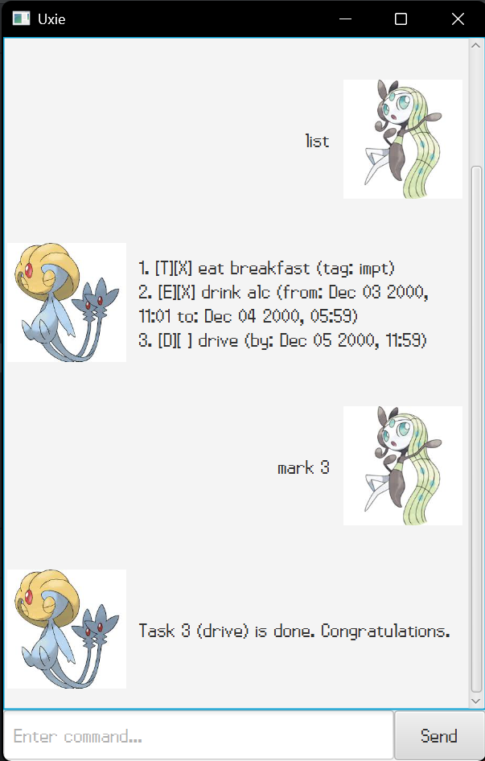

# Uxie User Guide



Revolutionize your productivity with **Uxie**: the only task management program powered by a REAL mythical Pokémon!


## Adding todos (`todo`)

Todos are tasks without any date or time attached.

Format: `todo <desc>`

Examples:
`todo Eat Breakfast`
> Adds a todo task to eat breakfast.


## Adding deadlines (`deadline`)

Deadlines are tasks with an ending date and time.

Format: `deadline <desc> /by <date-time>`
Date-time format: [d/MM/yyyy HHmm]

Examples:
`deadline Catch Lugia /by 3/11/1998 2359`
> Adds a deadline task to catch Lugia by 3rd November 1998, 11:59pm.


## Adding events (`event`)

Events are tasks with an starting and ending date and time.

Format: `event <desc> /from <date-time> /to <date-time>`
Date-time format: [d/MM/yyyy HHmm]

Examples:
`event Brunch @ Icirrus /from 4/12/1999 1030 /to 4/12/1999 1200`
> Adds an event for brunch at Icirrus City from 4th December 1999, 10:30am, to 12pm on the same day.


## List all tasks (`list`)

Lists all current tasks.

Format: `list`
Output Date-time format: [MMM dd yyyy, hh:mm]

Example output:
```
1. [T][X] Eat Breakfast (tag: impt)
2. [D][ ] Catch Lugia (by: Nov 03 1998, 11:59)
3. [E][ ] Brunch @ Icirrus (from: Dec 04 1999, 10:30 to: Dec 04 1999, 12:00)
```
> Lists tasks:
> A complete todo with description "Eat Breakfast" and tag "impt"
> An incomplete deadline with description "Catch Lugia", without a tag, and deadline date-time as shown.
> An incomplete event with description "Brunch @ Icirrus", without a tag, and from and to date-times as shown.


## Delete a task (`delete`)

Deletes a task by index.

Format: `delete <task-index>`
`task-index`: Index of task in task list (given by `list` command)


## Mark a task as complete (`mark`)

Marks a task as complete by index.

Format: `mark <task-index>`
`task-index`: Index of task in task list (given by `list` command)


## Mark a task as incomplete (`unmark`)

Marks a task as incomplete by index.

Format: `unmark <task-index>`
`task-index`: Index of task in task list (given by `list` command)


## Tag a task (`tag`)

Tags a task by index.

Format: `tag <task-index> <tag>`
`task-index`: Index of task in task list (given by `list` command)
`tag`: String to tag task as. If left empty, clears tag from task matching index.

Examples:
`tag 1 impt`
> Tags task with index 1 in list as "impt".

`tag 2`
> Clears tag from task with index 2 in list.


## Find a task by description (`find`)

Finds all tasks whose description contains the search string exactly.

Format: `find <search-string>`

Examples:
> List of tasks:
```
1. [T][X] Eat Breakfast (tag: impt)
2. [D][ ] Catch Lugia (by: Nov 03 1998, 11:59)
3. [E][ ] Brunch @ Icirrus (from: Dec 04 1999, 10:30 to: Dec 04 1999, 12:00)
```

`find Br`
> Output:
```
Here are the matching tasks:
1. [T][X] Eat Breakfast (tag: impt)
3. [E][ ] Brunch @ Icirrus (from: Dec 04 1999, 10:30 to: Dec 04 1999, 12:00)
```

`find Catch L`
> Output:
```
Here are the matching tasks:
2. [D][ ] Catch Lugia (by: Nov 03 1998, 11:59)
```


## Exit the program (`bye`, `goodbye`)

Exits the program.

Format: `bye` or `goodbye`